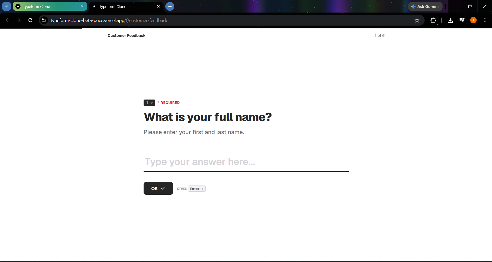
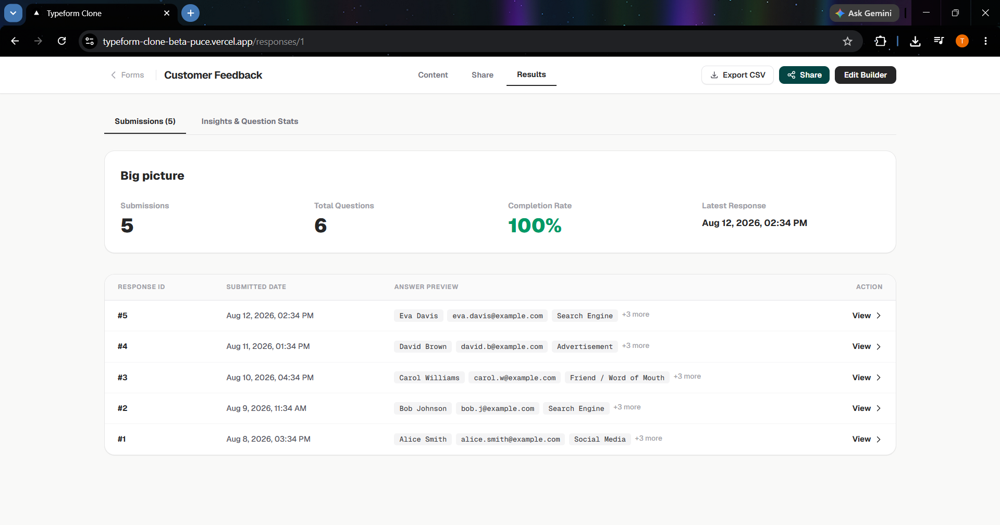
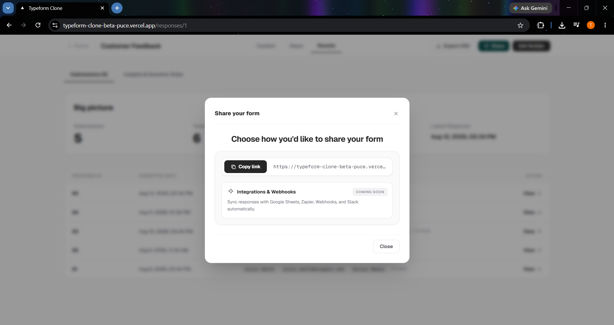

# Typeform Clone - Form Builder & Response Management Platform

A full-stack Typeform-inspired application for creating, configuring,
publishing, sharing, and managing interactive forms. The project focuses
on a clean Typeform-style creator experience, a one-question-at-a-time
respondent flow, response analytics, and CSV export.

**Version:** 1.0.0\
**Frontend:** Next.js / React\
**Backend:** FastAPI / Python\
**Database:** SQLite / SQLAlchemy\
**Deployment:** Vercel + PythonAnywhere

## Live Demo

**Frontend:** https://typeform-clone-beta-puce.vercel.app/

**Backend API:** https://trishya1101.pythonanywhere.com/

## Project Links

- **Live Application:** https://typeform-clone-beta-puce.vercel.app/
- **GitHub Repository:** https://github.com/trishyanigam/typeform-clone
- **Backend API:** https://trishya1101.pythonanywhere.com/

------------------------------------------------------------------------

## Table of Contents

-   [Overview](#overview)
-   [Key Features](#key-features)
-   [Application Preview](#application-preview)
-   [System Architecture](#system-architecture)
-   [Database Design](#database-design)
-   [Installation](#installation)
-   [Database Seeding](#database-seeding)
-   [Usage](#usage)
-   [API Overview](#api-overview)
-   [Project Structure](#project-structure)
-   [Supported Question Types](#supported-question-types)
-   [Business Logic](#business-logic)
-   [Assignment Scope](#assignment-scope)
-   [Assumptions and Trade-offs](#assumptions-and-trade-offs)
-   [Future Improvements](#future-improvements)

------------------------------------------------------------------------

## Overview

The Typeform Clone recreates the core workflow of a modern form
platform:

``` text
Create Form → Add Questions → Configure → Preview → Publish
                                           ↓
                                      Share Form
                                           ↓
                                    Collect Responses
                                           ↓
                              View Results / Statistics
                                           ↓
                                      Export CSV
```

The application is divided into a creator experience and a respondent
experience.

### Creator Experience

Creators can manage their forms from a workspace dashboard, open a
visual form builder, configure questions, publish forms, share public
links, and review submitted responses.

### Respondent Experience

Respondents access a published form through its public URL and complete
questions using a Typeform-style, one-question-at-a-time interface.

------------------------------------------------------------------------

## Problem Statement

Traditional form builders can expose too many controls at once and make
the form creation process feel complicated.

The goal of this project is to provide:

-   A simple creator dashboard
-   An intuitive question builder
-   A focused respondent experience
-   Required-field validation
-   Published public forms
-   Response management
-   Basic response insights
-   CSV export for collected data

------------------------------------------------------------------------

## Solution

This project implements the core form-building and response workflow
using a React/Next.js frontend and FastAPI backend.

The UI is intentionally inspired by Typeform's visual language while
keeping the implementation focused on the assignment requirements.

------------------------------------------------------------------------

## Key Features

### Form Management

-   Create forms
-   Edit forms
-   Delete forms
-   Draft and published states
-   Publish / unpublish forms
-   Duplicate forms
-   Response count on dashboard
-   Creator workspace dashboard

### Form Builder

-   Add questions
-   Edit question title
-   Add optional descriptions
-   Configure question type
-   Mark questions as required
-   Configure question options
-   Reorder questions
-   Delete questions
-   Preview published forms
-   Typeform-inspired builder layout

### Respondent Experience

-   Public form URL
-   One-question-at-a-time flow
-   Progress indicator
-   Required-question validation
-   Text input
-   Multiple choice selection
-   Dropdown selection
-   Yes/No selection
-   Rating selection
-   Form submission

### Results & Analytics

-   Submission count
-   Total question count
-   Completion rate
-   Latest response timestamp
-   Individual response list
-   Individual response details
-   Question-level response statistics
-   CSV export

### Assignment-Scope Placeholders

The following are intentionally shown as **Coming Soon** rather than
being implemented as full features:

-   Advanced logic / branching
-   Integrations and webhooks
-   Team collaboration and sharing
-   Payment question type
-   File-upload question type

This keeps the UI aligned with the requested scope without falsely
presenting unsupported functionality as implemented.

------------------------------------------------------------------------

# Application Preview

## Creator Dashboard

The dashboard provides a workspace-style view of created forms, their
publication state, response count, and actions.


------------------------------------------------------------------------

## Form Builder

The builder uses a three-part Typeform-inspired layout:

``` text
Questions / Pages  →  Live Question Preview  →  Question Settings
```

Creators can select a question, edit its configuration, and see the
question presentation in the central preview.


------------------------------------------------------------------------

## Public Form

The respondent interface uses a focused one-question-at-a-time
experience inspired by Typeform.



------------------------------------------------------------------------

## Results

The results page provides submission statistics and a list of collected
responses.



The implemented results view includes:

-   Submission count
-   Total questions
-   Completion rate
-   Latest response
-   Response previews
-   Individual response viewing
-   CSV export

------------------------------------------------------------------------

## Sharing

Published forms can be shared using their public URL.



Unsupported integrations are clearly marked as **Coming Soon**.

------------------------------------------------------------------------

# System Architecture

## Technology Stack

### Frontend

-   Next.js
-   React
-   TypeScript
-   Tailwind CSS
-   Client-side API integration

### Backend

-   Python
-   FastAPI
-   Uvicorn
-   SQLAlchemy
-   REST-style API

### Database

-   SQLite
-   SQLAlchemy ORM

### Deployment

-   Vercel for the frontend
-   PythonAnywhere for the backend

------------------------------------------------------------------------

## Architecture Overview

``` text
┌──────────────────────────────────────────┐
│              Browser / User              │
└────────────────────┬─────────────────────┘
                     │
                     ▼
┌──────────────────────────────────────────┐
│            Next.js / React UI            │
│                                          │
│ Dashboard                                │
│ Form Builder                             │
│ Public Form                              │
│ Results                                  │
│ CSV Export                               │
└────────────────────┬─────────────────────┘
                     │
                 HTTP / JSON
                     │
                     ▼
┌──────────────────────────────────────────┐
│              FastAPI Backend             │
│                                          │
│ Form Management                          │
│ Question Management                      │
│ Publishing                               │
│ Public Form Submission                   │
│ Response Management                      │
└────────────────────┬─────────────────────┘
                     │
                SQLAlchemy
                     │
                     ▼
┌──────────────────────────────────────────┐
│                 SQLite                   │
│                                          │
│ Forms → Questions                        │
│ Forms → Responses                        │
│ Responses → Answers                      │
└──────────────────────────────────────────┘
```

------------------------------------------------------------------------

# Database Design

## Entity Relationship Model

``` text
                 ┌───────────────┐
                 │     Forms     │
                 └───────┬───────┘
                         │
              ┌──────────┴──────────┐
              │                     │
             1:N                   1:N
              │                     │
              ▼                     ▼
       ┌───────────────┐    ┌────────────────┐
       │   Questions   │    │   Responses    │
       └───────┬───────┘    └───────┬────────┘
               │                    │
               │                    │ 1:N
               │                    ▼
               │             ┌───────────────┐
               └────────────►│    Answers    │
                             └───────────────┘
```

## Main Entities

### Forms

Stores form-level information.

Typical fields include:

-   `id`
-   `title`
-   `slug`
-   `status`
-   timestamps

### Questions

Stores questions belonging to a form.

Typical fields include:

-   `id`
-   `form_id`
-   `type`
-   `title`
-   `description`
-   `required`
-   `position`
-   question-specific settings

### Responses

Represents one completed submission.

Typical fields include:

-   `id`
-   `form_id`
-   submission timestamp

### Answers

Stores the value supplied for a question within a response.

Typical fields include:

-   `id`
-   `response_id`
-   `question_id`
-   `value`

------------------------------------------------------------------------

# Installation

## Prerequisites

-   Python 3.11+
-   Node.js 18+
-   npm
-   Git

## 1. Clone the Repository

``` bash
git clone https://github.com/trishyanigam/typeform-clone.git
cd typeform-clone
```

## 2. Backend Setup

``` bash
cd backend
python -m venv .venv
```

### Windows

``` powershell
.venv\Scripts\activate
```

### Linux / macOS

``` bash
source .venv/bin/activate
```

Install dependencies:

``` bash
pip install -r requirements.txt
```

## 3. Environment Configuration

Create the backend environment file as required by the deployment
configuration.

Example:

``` env
DATABASE_URL=sqlite:///./typeform.db
FRONTEND_URL=http://localhost:3000
```

For the frontend, create `.env.local`:

``` env
NEXT_PUBLIC_API_URL=http://localhost:8000/api
```

The deployed frontend should use the deployed backend API URL instead.

## 4. Start Backend

``` bash
uvicorn main:app --reload --port 8000
```

Backend:

``` text
http://localhost:8000
```

## 5. Start Frontend

Open another terminal:

``` bash
cd frontend
npm install
npm run dev
```

Frontend:

``` text
http://localhost:3000
```

------------------------------------------------------------------------

# Database Seeding

The project includes a seed script for creating sample forms, questions,
and responses.

From the backend directory:

``` bash
python seed.py
```

The seed data is useful for quickly testing:

-   Dashboard form cards
-   Published forms
-   Form builder
-   Response pages
-   Statistics
-   CSV export

------------------------------------------------------------------------

# Usage

## Creator Workflow

1.  Open the dashboard.
2.  Create a form.
3.  Enter the form title.
4.  Add questions.
5.  Select the question type.
6.  Configure question-specific options.
7.  Mark required questions where needed.
8.  Reorder or delete questions.
9.  Preview the form.
10. Publish the form.
11. Copy the public form link.
12. Share the link with respondents.
13. Open Results after responses are submitted.
14. Review individual submissions.
15. Review question statistics.
16. Export responses as CSV.

## Respondent Workflow

1.  Open the public form URL.
2.  Read the current question.
3.  Enter or select an answer.
4.  Continue to the next question.
5.  Complete all required questions.
6.  Submit the form.
7.  The response is stored by the backend.

------------------------------------------------------------------------

# API Overview

The frontend communicates with the FastAPI backend through JSON-based
HTTP requests.

## Forms

``` text
GET     /api/forms
GET     /api/forms/{id}
POST    /api/forms
PUT     /api/forms/{id}
DELETE  /api/forms/{id}

POST    /api/forms/{id}/publish
POST    /api/forms/{id}/unpublish
POST    /api/forms/{id}/duplicate
```

## Questions

``` text
GET     /api/forms/{formId}/questions
POST    /api/forms/{formId}/questions

PUT     /api/questions/{questionId}
DELETE  /api/questions/{questionId}

PUT     /api/forms/{formId}/questions/reorder
```

## Public Forms

``` text
GET     /api/public/forms/{slug}
POST    /api/public/forms/{slug}/responses
```

## Responses

``` text
GET     /api/forms/{formId}/responses
GET     /api/forms/{formId}/responses/{responseId}
GET     /api/forms/{formId}/response-stats
GET     /api/forms/{formId}/responses/export
```

> Endpoint paths should be kept synchronized with the implementation if
> the backend route names differ.

------------------------------------------------------------------------

# Project Structure

``` text
typeform-clone/
│
├── backend/
│   ├── app/
│   │   ├── database.py
│   │   ├── models.py
│   │   └── routes/
│   │       ├── forms.py
│   │       ├── questions.py
│   │       ├── public.py
│   │       └── responses.py
│   │
│   ├── main.py
│   ├── seed.py
│   ├── requirements.txt
│   └── typeform.db
│
├── frontend/
│   ├── app/
│   ├── components/
│   ├── lib/
│   ├── public/
│   ├── package.json
│   └── .env.local
│
├── docs/
│   └── screenshots/
│       ├── dashboard.png
│       ├── builder.png
│       ├── public-form.png
│       ├── responses.png
│       └── share-modal.png
│
└── README.md
```

------------------------------------------------------------------------

# Supported Question Types

  Question Type     Purpose
  ----------------- ------------------------------
  Short Text        Short free-form answers
  Long Text         Multi-line answers
  Email             Email responses
  Number            Numeric responses
  Multiple Choice   Select one configured option
  Dropdown          Select from a dropdown
  Yes / No          Binary choice
  Rating            Numeric rating

Each question is configured from the builder's question settings panel.

------------------------------------------------------------------------

# Business Logic

## Form Lifecycle

``` text
              ┌─────────┐
              │  Draft  │
              └────┬────┘
                   │
              Publish
                   │
                   ▼
            ┌────────────┐
            │ Published  │
            └─────┬──────┘
                  │
        Accept Responses
                  │
                  ▼
             Responses
                  │
              Unpublish
                  │
                  ▼
               Draft
```

## Validation

-   Required questions must be answered.
-   Published forms are available through their public URL.
-   Question ordering is preserved.
-   Question-specific settings are validated before submission.
-   Responses are associated with the correct form and questions.

## Response Processing

``` text
Public Form
    │
    ▼
Validate Answers
    │
    ▼
Create Response
    │
    ▼
Store Answers
    │
    ▼
Update Response Statistics
    │
    ├── View Submission
    ├── View Insights
    └── Export CSV
```

------------------------------------------------------------------------

# Assignment Scope

The implementation prioritizes the required core functionality.

## Implemented

-   Form creation and management
-   Form builder
-   Question configuration
-   Required questions
-   Multiple question types
-   Draft / published state
-   Public form submission
-   Response storage
-   Response listing
-   Response details
-   Response statistics
-   CSV export
-   Typeform-inspired UI

## Coming Soon Placeholders

The following are deliberately represented as placeholders instead of
being falsely implemented:

-   Advanced logic jumps / branching
-   Integrations / webhooks
-   Team collaboration
-   Payment questions
-   File-upload questions

This follows the assignment scope while keeping the UI clear about which
capabilities are not currently available.

------------------------------------------------------------------------

# Bonus Features

The project includes the following bonus functionality where
implemented:

### CSV Export

Creators can export collected responses from the Results page using the
**Export CSV** action.

### Partial Response / Completion Analytics

The Results page presents a completion rate alongside submission
statistics.

### Logic / Branching

Advanced logic and branching remain marked as **Coming Soon** rather
than being presented as implemented functionality.

### Custom Themes / Dark Mode / File Upload

These remain outside the current implementation scope unless explicitly
enabled in the deployed application.

------------------------------------------------------------------------

# Assumptions and Trade-offs

## Authentication

The assignment allows a simplified creator experience, so a full
multi-user authentication and authorization system is not required for
the current scope.

## Database

SQLite keeps local setup simple and is appropriate for an
assignment/demo application. A production-scale deployment with higher
concurrency would benefit from PostgreSQL.

## Flexible Question Configuration

Question-specific settings can be represented flexibly so that different
question types can store their own configuration without requiring a
separate table for every question type.

## Typeform-Inspired UI

The UI follows the interaction patterns and visual hierarchy of Typeform
while remaining an independent implementation.

The project does not attempt to reproduce every Typeform feature.
Unsupported features are intentionally shown as **Coming Soon** where
appropriate.

------------------------------------------------------------------------

# Deployment

## Frontend

The frontend is deployed through Vercel.

Production configuration should point the frontend API variable to the
deployed backend:

``` env
NEXT_PUBLIC_API_URL=https://trishya1101.pythonanywhere.com/api
```

## Backend

The FastAPI backend is deployed separately on a Python-compatible
hosting environment.

The deployed frontend communicates with this backend through the
configured API URL.

## Production Verification

After deployment, verify:

``` text
✓ Dashboard loads
✓ Forms are visible
✓ Builder loads
✓ Published form opens
✓ Public form accepts responses
✓ Responses appear in Results
✓ Statistics update
✓ CSV export works
✓ Share link opens the public form
✓ Coming Soon features remain clearly marked
```

------------------------------------------------------------------------

# Future Improvements

-   Full creator authentication
-   Multiple workspaces
-   Team collaboration
-   Conditional logic and branching
-   Webhook integrations
-   File uploads
-   Payment questions
-   Custom themes
-   Advanced analytics
-   Response filtering
-   PostgreSQL for larger deployments
-   Automated tests
-   API rate limiting
-   Improved accessibility

------------------------------------------------------------------------

# Development Notes

Run the frontend and backend independently during development.

### Backend

``` bash
cd backend
.venv\Scripts\activate
uvicorn main:app --reload --port 8000
```

### Frontend

``` bash
cd frontend
npm run dev
```

Then open:

``` text
http://localhost:3000
```

------------------------------------------------------------------------

# License

This project was developed as a full-stack assignment demonstrating form
creation, question configuration, public response collection, REST API
development, relational data modeling, response analytics, and
frontend-backend integration.
